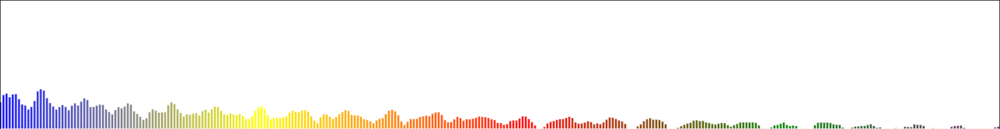

# MusicSpectrumVIsualizer
Web音乐频谱可视化



### 食用方法

``` html
<canvas id="wrap"></canvas>
<audio id="audio" src="assets/UNICORN.mp3"></audio>

<button id="play">Play</button>
<button id="pause">Pause</button>

<script src="js/main.js"></script>
```
然后
``` javascript
let canvas = document.querySelector('#wrap');
let audio = document.querySelector('#audio');

let fre = new MusicFrequency(canvas, audio);
fre.drawSpectrum();

document.querySelector('#play').onclick = () => {
    fre.audio.play();
}
        
document.querySelector('#pause').onclick = () => {
    fre.audio.pause();
}
```
MusicFrequency的构造函数如下：

`constructor(canvas, audio, width = null, height = null, color=null, lineWidth=null, vHight=null) { ... }`

- canvas：  绘制频谱的画布对象
- audio：  Audio对象
- width：  canvas宽度，默认与屏幕等宽
- height：  canvas高度，默认200
- color：  频谱渐变颜色，它是形如[[0, "blue"], [0.25, "yellow"], [0.5, "red"], [0.75, "green"], [1, "purple"]]这样的数组(也是默认值)，数字取值0~1
- lineWidth：  频谱宽度，默认为canvas.width / 360 / 1.6
- vHeight： 频谱高度，**数值越小频谱越高**


